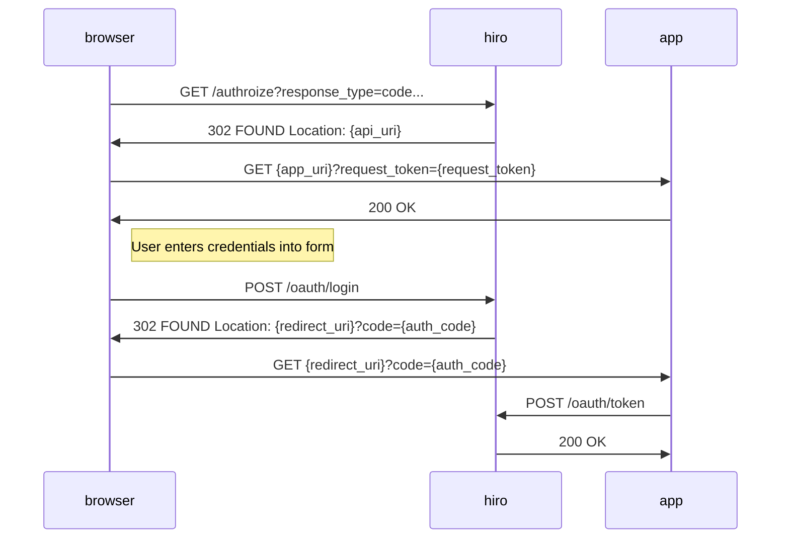

# Hiro Oauth 2.0

This package provides a base OAuth 2.0 implementation for Model Rocket projects.

## Pre-requisites
The comsumer only needs to implements the `Controller` and associated interfaces to provide backend storage for requests, tokens, and sessions.

## Controller

### Structs

### Interfaces

## Flows

Hiro OAuth supports a limited set of authorization flows. This is due both to need, but also to avoid unecessary security risk.
### Authorization Code

Unlike other OAuth libraries, for the `authorization_code` grant `hiro` does not provide any html forms, these are abstracted securly from the project and expected to be hosted externally. This allows for each application to have custom login interfaces.

`hiro` makes his process secure by generating a login request token in the [authorize route](#get-authorize) handler and redirecting the browser to the `app_uri` specified in the query. The browser will then post the the [login route](#post-login), including this token and the PKCE code verifier to authenticate the user. The browser will then be redirected to the `redirect_uri` provided in the authorize call, which will have the standard code parameter that can be used to request a bearer token.

### Client Credentials

### Refresh Token

## API
The API is informally defined in this [OpenAPI 2.0 Spec](../../api/swagger/v1/oauth.swagger.yaml). This spec is self-contained and is served in the `/oauth/swagger.{json|yaml}` route for clients to access.

### Routes
The package provides a `Routes` set that is designed to be used with the [api.Server](../api/README.md) package, which can extend another api service adding authentication support.
### `GET /authorize`

### `POST /login`

### `GET /token`

## Sessions